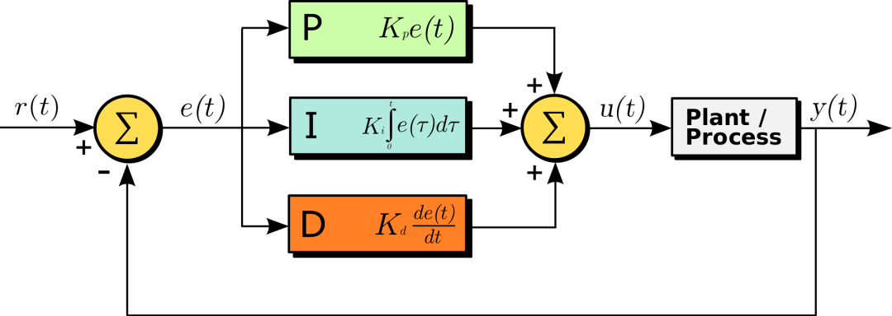

# PID Control

> zhangqq
> Apr 20, 2023
> Chongqing

---

PID: Proportial（比例）, Integral（积分）, Derivative（微分）
$$
u=K_pe(t) + K_i\int e(t)dt + K_d\frac{\mathrm{d}e(t)}{\mathrm{d}t}
$$

Plant/Process即被控系统。

调参：

- $K_p$越大，越快逼近目标值，但震荡也越大
- $K_i$则抑制震荡，使其平稳
- $K_d$保证接近目标值

